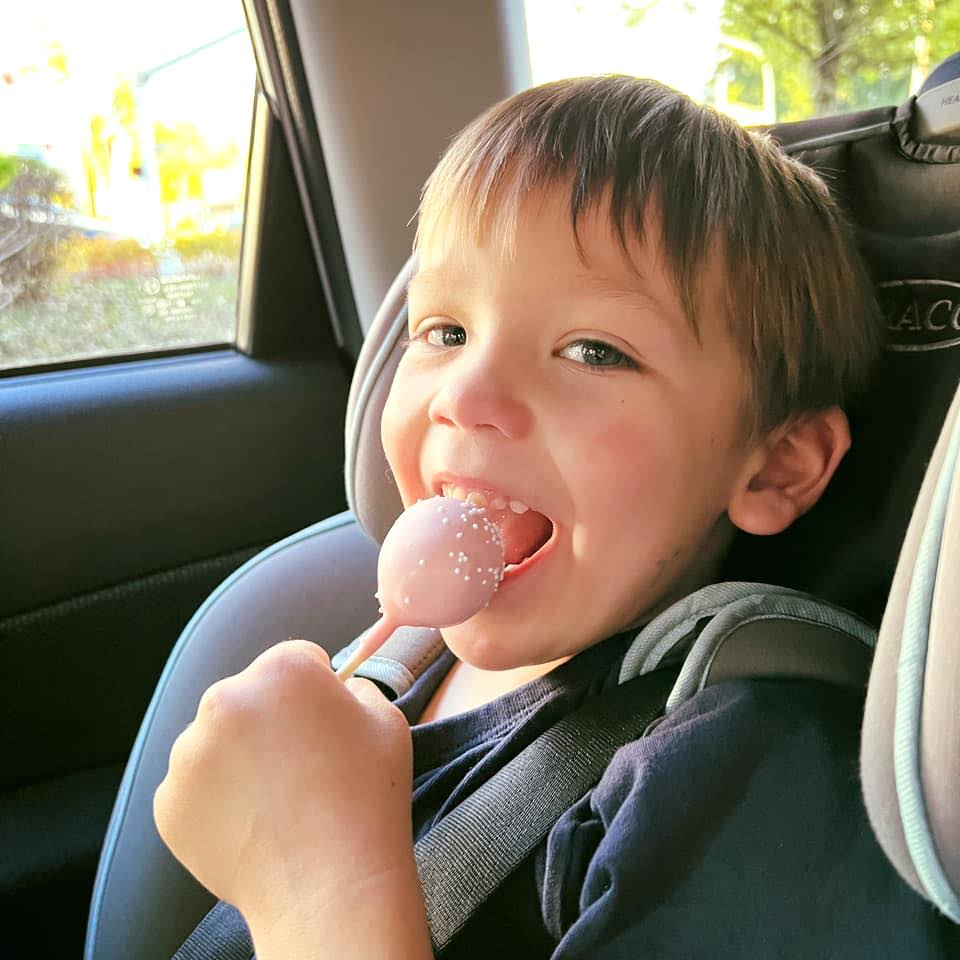

Welcome! My hope in sharing our story of Autism is to provide a safe place where people can learn and ask questions about Autism. This is a space to share my hope, joy, and challenge, as our family and "village" raise our 4yo son, Evan.

Anything shared, I will do my best to protect Evan, while at the same time being vulnerable as to the realities. I am not perfect, but progress over perfection in this journey.

My hope is that Autism will cease to be a whispered "dirty word" or one where Autism is viewed simplistically. By sharing, may our world be a more Autism-engaging place for him and the Autism community!